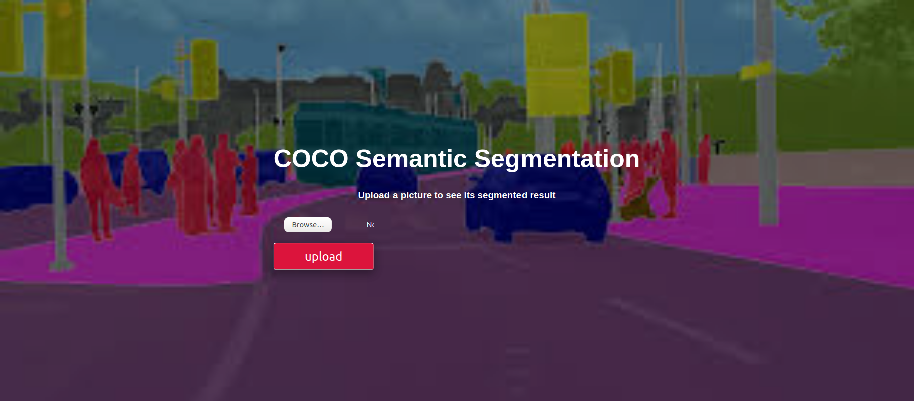

# Springboard Capstone Project Production

## Deploy COCO Semantic Segmenation Model with Web Interface - Docker, Flask & Pytorch

| Backbone  | train/eval os  |mIoU in val |Pretrained Model|
| :-------- | :------------: |:---------: |:--------------:|
| ResNet    | 16/16          | 58.3%      | [google drive](https://drive.google.com/open?id=1ekHSU34le7G3pk7MT_aohMQlLq9_cDCR)  |

<p align="center">
  
   
</p>

## Running on local/cloud machine
Clone the repo and build the docker image

```
sudo docker build -t deployml .
```

NB: if you have MemoryError while installing Pytorch in container, please consider adding additional memory to your virtual machine.

Then after that you can create the container while specifying the absolute path to the app

```
sudo docker run -i -t --rm -p 8888:8888 -v **absolute path to app directory**:/app deployml
```

This will run the application on localhost:8888

## Info

For more information, please visit the main repository [[website]](http://github.com/bluepika2/Springboard-Capstone)
