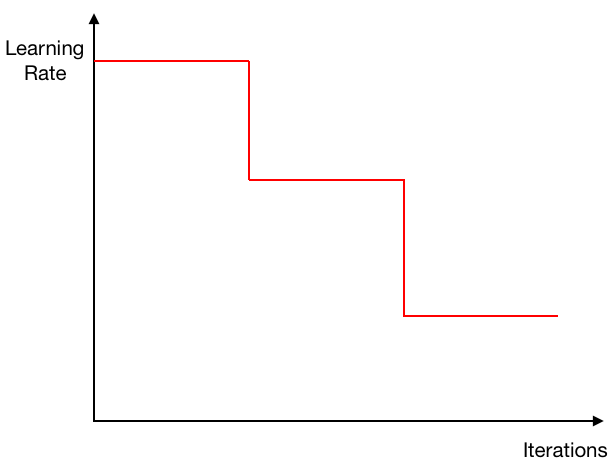

# Springboard Capstone Project

## COCO Semantic Segmenation in Pytorch

| Backbone  | train/eval os  |mIoU in val |Pretrained Model|
| :-------- | :------------: |:---------: |:--------------:|
| ResNet    | 16/16          | 58.3%      | [google drive](https://drive.google.com/open?id=1ekHSU34le7G3pk7MT_aohMQlLq9_cDCR)  |

## Introduction
This is a PyTorch implementation of Deeplab V+3 based on COCO dataset. Currently, I am transferring Jupyter Notebook to python modules.


### Model
- (**Deeplab V3+**) Encoder-Decoder with Atrous Separable Convolution for Semantic Image Segmentation [[Paper]](https://arxiv.org/pdf/1802.02611)

### Dataset
- **COCO Stuff:** For the official dataset with all of the training 164k samples, validation 5k samples, it can be downloaded from the official [[website]](http://cocodataset.org/#download).

### Learning rate schedulers
- **Poly learning rate**: The learning rate is scaled down linearly from the starting value down to zero during training.
- **Step learning rate**: Step decay schedule drops the learning rate by a constant factor every few epochs
- **Cosine learning rate**: The learning rate decrease in the form of half a cosine curve

<p align="center">
  
   
  
</p>

### Data augmentation
All of the data augmentations are implemented based on Pytorch transform module, which are: random croping between 0.5 and 2 of the selected crop_size, random h-flip and Gaussian blurring.

## Training
To train a model, first download the dataset to be used to train the model.
1. Configure your dataset path in `mypath.py`.
2. Put input arguments to train.py file (see full input arguments through train.py -h)
```
--backbone     backbone name for the model (default: resnet).
--out-stride   network output strides (default: 16).
--workers      dataloader threads (default: 4)
--dataset      dataset name (default: coco)
--epochs       number of epochs to train (default: auto)
--batch-size   input batch size for training (default: auto)
```
The training will automatically be run on the GPUs (torch.nn.DataParalled is used for multi-gpu training), if not the CPU is used. The log files will be saved in code/run and the .pth chekpoints in code/run/coco/deeplab-resnet, to monitor the training using tensorboard, please run:
```
tensorboard --logdir run
```

## Inference
For inference, we need a PyTorch trained model, the images we'd like to segment and the input arguments (to load the correct model and other parameters). Put input arguments to inference.py file.
```
--in-path      folder containing test images (required)
--out-path     folder to save mask image results (default: 'inference_results').
--ckpt         path to trained model (default='modeling/deeplab-resnet.pth.tar')
```
The predictions will be saved as `.jpg` images using the default palette in the passed folder name, if not, `inference_results\` is used.
21 classes are used in this model out of total classes in COCO dataset.


### Result examples
<p align="center">
  
   
</p>
<p align="center">
  
   
</p>
<p align="center">
  
   
</p>

## Code Structure
  ```
  code/
  │
  ├── train.py - main script to start training
  ├── inference.py - inference using a trained model
  ├── mypath.py - to define dataset directory
  │
  ├── dataloader/ - loading the data for different segmentation datasets
  │   ├── custom_transforms.py - include transform function for data augmentation
  │   └── utils.py - helper function to encode and decode images
  │
  ├── modeling/ - contains semantic segmentation models
  │   ├── deeplab.py - include main structure for deeplab network
  │   ├── aspp.py - include atrous spatial pyramid pooling structure
  │   └── decoder.py - include transposed convolution parts for decoder
  │  
  └── utils/ - small utility functions
      ├── losses.py - losses used in training the model
      ├── metrics.py - evaluation metrics used
      ├── saver.py - helper function to save parameters and model progress
      ├── summaries.py - create tensorboard summary from results
      └── lr_scheduler.py - learning rate schedulers 
  ```
  
## Acknowledgement
[PyTorch-Encoding](https://github.com/zhanghang1989/PyTorch-Encoding)

[Synchronized-BatchNorm-PyTorch](https://github.com/vacancy/Synchronized-BatchNorm-PyTorch)

[drn](https://github.com/fyu/drn)